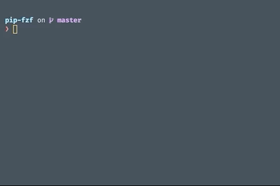

# pip-fzf

Smart fuzzy completion for pip.



## Usage

Simply type in `pip install` or `pip uninstall` followed by `**`,
and press <kbd>tab</kbd>.
Start typing in the name of the packages
to search through the available results.
Press <kbd>tab</kbd> to mark each result.
Press <kbd>return</kbd> to select all marked results.

The `install` completion will allow you to search through
all packages on [PyPI](https://pypi.org/).

```shell
❯ pip install ** [TAB]
> flake8
240273/240273
>   flake8
    flake8-nb
    flake8-aaa
    flake8-csv
    flake8mock
    flake8-pie
    flake8-pyi
    flake8-rst
```

The `uninstall` command allows you to search through all installed packages.

```shell
❯ pip uninstall ** [TAB]
> 
9/9
>   black
    flake8
    flask
    invoke
    nox
    pandas
    pip
    pytest
    setuptools
```

## Install

### Dependencies

Fuzzy completion will not run without the following tools installed:

- [pip](https://pypi.org/project/pip/)
- [fzf](https://github.com/junegunn/fzf)
- [curl](https://curl.haxx.se/)

Install all three tools using any of the documented methods on the respective sites.

You must install the fuzzy completion for fzf.

For example,
if you installed fzf via [Homebrew](https://brew.sh/),
this can be accomplished by running

```shell
# If fzf was installed via Homebrew
❯ $(brew --prefix)/opt/fzf/install
```

### Adding fuzzy pip completion

Installing the above packages is the hardest part.

Run

```shell
❯ git clone https://github.com/paw-lu/pip-fzf.git ~/.pip-fzf
```

Now add

```shell
source "$HOME/.pip-fzf/pip_fzf.sh"
```

to the end of your `.zshrc`/`.bashrc`/`.bash_profile`/etc.

You should now have fuzzy completion for pip after you restart your shell.

Of course,
you can also just copy the functions in `pip_fzf.sh`,
and place them directly in your `.zshrc`,
or [autoload](http://zsh.sourceforge.net/Doc/Release/Functions.html) them from another directory.
